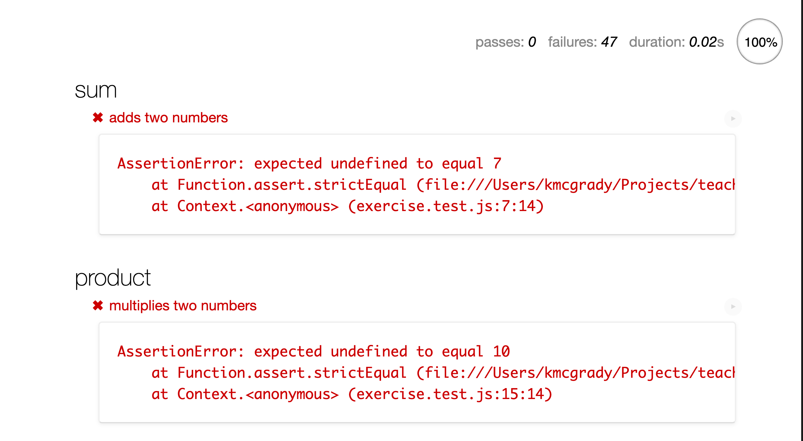
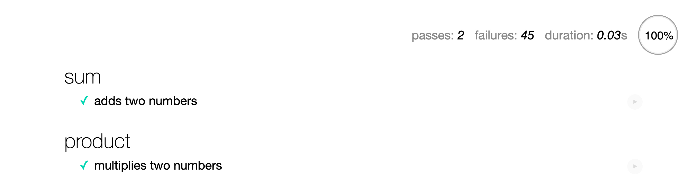

# JavaScript Basics

In this exercise, you'll need to solve a set of increasingly difficult puzzles aimed at helping you master the fundamentals of JavaScript. The exercise is split into two parts.

The `primitives` folder has you wrestling with:

- Primitives Data Types
- Variables Declarations
- Globals
- Operators
- Conditionals

The `arrays_and_objects` folder has your wresting with:

- All of the above
- Arrays
- Objects
- Loops

**TIP:** Please use online documentation to lookup how to use concepts. Try NOT to google for the answer to the problem.

## Goal

Your goal is to update the JavaScript code so that the test passes. Open up the `index.html` in your browser. This can be done in two ways: via the command line

**macOS/Linux**

```
$ open index.html
```

**Windows**

```
$ start index.html
```

Or by opening the file through the browser.

Most browsers have a menu option of `Open File...` under the `File` menu. Navigate to your folder and select `index.html`

Select the exercise you want to do, and you should see a lot of red.



You would make changes in the corresponding JS file (`exercise.js` or `bonus.js`). Each test set uses a set of functions. Don't worry about the function syntax just yet, we provide most of the work for you. Add your code where you see `// YOUR CODE HERE`. When you have a solution, be sure to add a `return` statement before your final answer.

As you make changes, refresh the browser by clicking on the circular arrow button or pressing the keyboard shortcut Cmd (Ctrl in Windows/Linux) + R

## Wrestle with it

You may encounter challenges that seem confusing or impossible. Don't despair! This exercise is designed to challenge you. Resist the urge to just copy-and-paste code from your classmates, but definitely ask for help and talk to your peers.

When you finish each piece of code successfully, your page would show more green like this. Green check marks next to each test means the entire test suite is passing.



When you're done with the main assignment, you should see no failures and all the tests passing (no red on the page).

## Bonus

Each exercise also has a bonus section for some more difficult problems. If you have extra time, and you would like to
